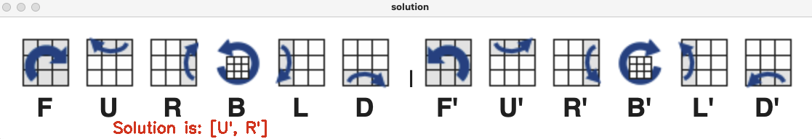

# Rubiks Cube Solver

### Use Open-CV and Python to solve a rubik's cube

---

### Project Architecture and Explanations
1. <ins>Detect 9 cubes for each face:</ins>  
The original plan was to detect the contours from the live webcam video, extract the 9 cube and identify each color.
Unfortunately I was unable to find the contours and therefore had to find a different solution.
I marked on the display panel a grid of 3*3 and instruct the user to place the cube in position.
Now that I have the exact location of each cube of the face, I can continue to identify the colors.
2. <ins>Classify the colors:</ins>  
My first attempt to detect the color of each cube was based on blogs and Githubs such as https://www.pyimagesearch.com/2014/08/04/opencv-python-color-detection/ 
that mask the image using upper and lower boundaries for each color. 
This method didn't work properly for me and mainly wasn't accurate enough
hence I needed to find a different algorithm. 
My plan B was to simply compare the BGR values to a predefined set of values for each color.
3. <ins>Calibrate ground truth for each color:</ins>  
Prior to identifying the colors of each face I created a calibration step
where the program selected the center pixcel in the appropriate box and saves the BGR values in regard to the camera, lighting etc.
Since this approach wasn't robust enough, I calculated the average BGR values of the whole calibration box.
I've implemented this approach also in the identification process, i.e. 
I calculated the average BGR value for each cube in the face and found the best match.
4. <ins>Solving the cube:</ins>  
Once I was able to identify all the colors correctly I created a string that represented the cube 
according to this library: https://github.com/Wiston999/python-rubik and got back the solution.
5. <ins>Display the solution:</ins>  
I took the solution and showed to the user along with the instructions for each step
from here: https://ruwix.com/the-rubiks-cube/algorithm/#:~:text=A%20Rubik's%20Cube%20algorithm%20is,pieces%20in%20a%20certain%20way.&text=To%20describe%20operations%20on%20the,)%2C%20D%20(Down).

---

### Program Flow
1. <ins>Calibration:</ins>  
Place each color in the designated box and press 'E' (as instructed on the screen)  
Important comments:
   1. Make sure the box is totally covered with the color.
   2. Try to avoid reflection and such.

3. <ins>Color Identification:</ins>  
Place each face in the designated grid and press the corresponding letter (as instructed on the screen)  
Important comments:
   1. the program prints the identified colors to the console.  
   Make sure the classification is accurate - if not - press 'A' and try again.
   2. Try to avoid reflection and such

4. <ins>Solve The Cube:</ins>  
Follow instructions on screen to solve the cube.  
If the instructions are to long and don't fit on the screen, 
either go to the console or redo the process with a half solved cube.

---

#### Dependencies:
```
numpy==1.19.4
opencv-python==4.5.1.48
rubik_solver==0.2.0
```

---

#### GitHub repo's that helped in developing this project:
1. GitHub libraries to solve the cube:
https://github.com/Wiston999/python-rubik  
2. Solution instruction explanation -
https://ruwix.com/the-rubiks-cube/algorithm/#:~:text=A%20Rubik's%20Cube%20algorithm%20is,pieces%20in%20a%20certain%20way.&text=To%20describe%20operations%20on%20the,)%2C%20D%20(Down).
3. Color identification (not in use):  
https://github.com/Sanjay-Leo/Multiple-Color-Detection/blob/master/color-detect.py  
this one too - https://techvidvan.com/tutorials/detect-objects-of-similar-color-using-opencv-in-python/  

---

#### TO DO
Display solution in slow motion on screen or
show arrows on screen according to solution steps. 
